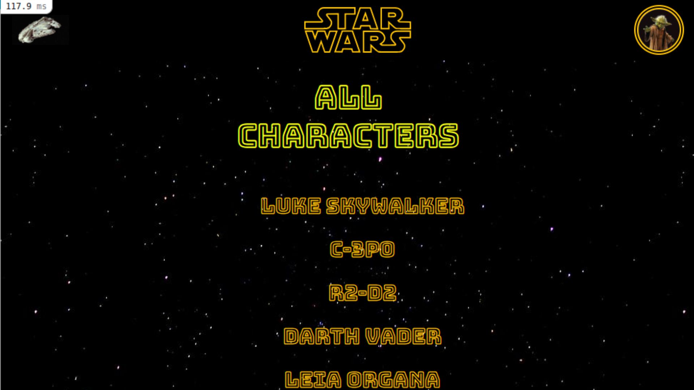
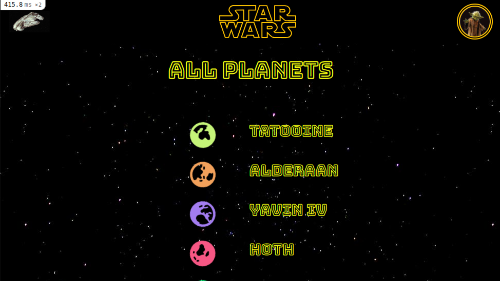
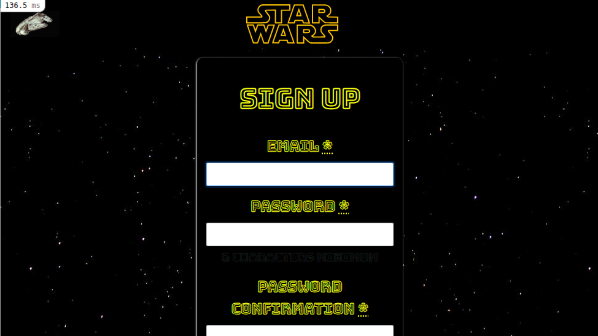

# API Star Wars 

https://api-star-wars-9ab4.onrender.com/

## 📷 Preview
   

Rails app generated with [lewagon/rails-templates](https://github.com/lewagon/rails-templates), created by the [Le Wagon coding bootcamp](https://www.lewagon.com) team.

It's a app using **Ruby on Rails, HTML, CSS, Bootstrap and Active Record**. 

⭐ MODELOS ⭐

- rails g model character name height mass birth_year
- rails g model planet name rails g model film title
- rails g model vehicle name model 
- rails g model starship name model 
- rails g model category name 
- rails g migration AddPlanetToCharacters planet:references 
- rails g migration AddCateogryToCharacters category:references
- rails g migration CreateJoinTableCharacterFilm character film 
- rails g migration CreateJoinTableCharacterVehicle character vehicle 
- rails g migration CreateJoinTableCharacterStarship character starship

The caracthers model has a method to send a full feed message through an API database https://swapi.dev/

RUN:
-bundle
-yarn

rails db:drop db:create db:migrate db:seed 🌱🌱🌱🌱🌱

https://api-star-wars-pulsus.herokuapp.com/
May the force be with you!
